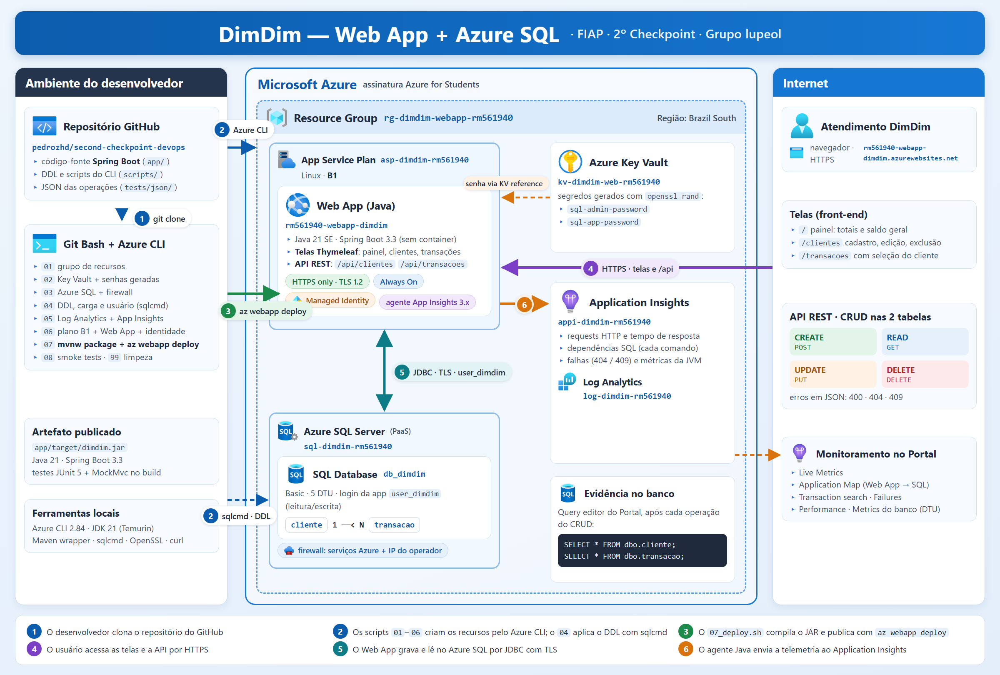

# Projeto DimDim — Aplicativo e Banco em Nuvem (Web App + Azure SQL)

**FIAP · Tecnologia em Desenvolvimento de Sistemas**
**DevOps Tools & Cloud Computing — 2º Checkpoint, 2º Semestre**

Aplicação web Java (Spring Boot) do banco digital **DimDim**, com telas e API
REST, publicada no **Azure App Service** (Web App, sem container), com
persistência no **Azure SQL Database** (PaaS), segredos no **Azure Key Vault**
e monitoramento pelo **Application Insights**. Todos os recursos são criados
por scripts **Azure CLI** e o deploy é feito com **`az webapp deploy`**.

**Vídeo da solução:** <LINK DO VÍDEO>

---

## Grupo lupeol

| RM | Nome | Papel |
|---|---|---|
| RM561940 | Pedro França | Representante |
| RM563558 | Olavo Neves | |
| RM564495 | Luiz Gonçalves | |

---

## Descrição da solução

O DimDim precisa de um sistema simples para o time de atendimento cadastrar
**clientes** e registrar as **transações** (créditos e débitos) de cada um.
A solução entrega:

- **Telas web** (Thymeleaf), com painel de totais e saldo geral, cadastro,
  edição e exclusão de clientes e de transações, e validação com mensagens em
  português;
- **API REST** (`/api/clientes`, `/api/transacoes`) com o mesmo CRUD, para
  integração com outros sistemas;
- **Regras protegidas no banco:** CPF único, tipo `CREDITO`/`DEBITO`, valor
  positivo e chave estrangeira que impede apagar um cliente com transações.
  Nesse caso, a tela avisa e a API devolve **409**.

**Benefícios para o negócio:** nenhum servidor para manter (App Service e
Azure SQL são PaaS), deploy repetível em um comando, senhas fora do código e
visibilidade de desempenho e falhas em tempo real pelo Application Insights.

---

## Arquitetura



| # | Fluxo |
|---|---|
| 1 | O desenvolvedor clona este repositório |
| 2 | Os scripts `01`–`06` criam os recursos na Azure via Azure CLI |
| 3 | O `07_deploy.sh` compila o JAR e o publica com `az webapp deploy` |
| 4 | O usuário acessa as telas e a API por HTTPS |
| 5 | O Web App grava e lê no Azure SQL por JDBC com TLS, como `user_dimdim` |
| 6 | O agente Java injetado pelo App Service envia a telemetria ao Application Insights |

A senha do banco chega ao Web App por **Key Vault reference**: a app setting
contém `@Microsoft.KeyVault(SecretUri=...)`, e o App Service a resolve com a
**Managed Identity** do Web App. A senha nunca aparece no Portal nem no código.

| Recurso | Nome | Configuração |
|---|---|---|
| Grupo de recursos | `rg-dimdim-webapp-rm561940` | `brazilsouth` |
| Key Vault | `kv-dimdim-web-rm561940` | senhas geradas com `openssl rand` |
| Azure SQL (servidor) | `sql-dimdim-rm561940` | TLS 1.2, firewall: serviços Azure + IP do operador |
| Azure SQL (banco) | `db_dimdim` | Basic, 5 DTU |
| Log Analytics | `log-dimdim-rm561940` | retenção 30 dias |
| Application Insights | `appi-dimdim-rm561940` | workspace-based |
| App Service Plan | `asp-dimdim-rm561940` | Linux B1 |
| Web App | `rm561940-webapp-dimdim` | Java 21 SE, Always On, HTTPS only |

---

## Modelo de dados

Duas tabelas com relacionamento 1:N: `cliente (1) ──< (N) transacao`.

| `cliente` | Tipo | Regra |
|---|---|---|
| `id_cliente` | BIGINT IDENTITY | PK |
| `nome` | NVARCHAR(120) | NOT NULL |
| `cpf` | NVARCHAR(11) | NOT NULL, UNIQUE, 11 dígitos (CHECK) |
| `email` | NVARCHAR(150) | NOT NULL |
| `data_cadastro` | DATETIME2(0) | NOT NULL, DEFAULT = agora no horário de Brasília |

| `transacao` | Tipo | Regra |
|---|---|---|
| `id_transacao` | BIGINT IDENTITY | PK |
| `id_cliente` | BIGINT | NOT NULL, FK → `cliente` (ON DELETE NO ACTION) |
| `descricao` | NVARCHAR(200) | NOT NULL |
| `valor` | DECIMAL(15,2) | NOT NULL, > 0 (CHECK) |
| `tipo` | NVARCHAR(10) | NOT NULL, `CREDITO` ou `DEBITO` (CHECK) |
| `data_transacao` | DATETIME2(0) | NOT NULL, DEFAULT = agora no horário de Brasília |

DDL completo e comentado: [`scripts/DDL.sql`](scripts/DDL.sql) ·
carga inicial: [`scripts/seed.sql`](scripts/seed.sql) ·
usuário da aplicação: [`scripts/app-user.sql`](scripts/app-user.sql)

---

## Telas

| Rota | Tela |
|---|---|
| `/` | Painel: total de clientes, de transações e saldo geral |
| `/clientes` | Lista de clientes, com editar e excluir |
| `/clientes/novo` · `/clientes/{id}/editar` | Formulário de cliente |
| `/transacoes` | Lista de transações com o nome do cliente |
| `/transacoes/nova` · `/transacoes/{id}/editar` | Formulário com seleção do cliente |

## Endpoints da API

| Recurso | Método | Retorno |
|---|---|---|
| `/api/clientes` | `GET` | 200 |
| `/api/clientes/{id}` | `GET` | 200 · 404 |
| `/api/clientes` | `POST` | 201 + `Location` · 400 · 409 |
| `/api/clientes/{id}` | `PUT` | 200 · 400 · 404 · 409 |
| `/api/clientes/{id}` | `DELETE` | 204 · 404 · **409** |
| `/api/transacoes` | `GET` | 200 |
| `/api/transacoes/{id}` | `GET` | 200 · 404 |
| `/api/transacoes` | `POST` | 201 + `Location` · 400 · 404 |
| `/api/transacoes/{id}` | `PUT` | 200 · 400 · 404 |
| `/api/transacoes/{id}` | `DELETE` | 204 · 404 |

JSON das operações GET, POST, PUT e DELETE de cada tabela: [`tests/json/`](tests/json/)

---

## Pré-requisitos

| Ferramenta | Versão usada | Para quê |
|---|---|---|
| Azure CLI | 2.84 | criar os recursos e publicar |
| sqlcmd | 15 (ODBC) | aplicar o DDL no Azure SQL |
| JDK | 21 (Temurin) | compilar (o Maven vem pelo wrapper `app/mvnw`) |
| Git | 2.55 | clonar |
| OpenSSL e curl | já vêm no Git Bash | gerar senhas e testar |

Os scripts são Bash. No Windows, use o **Git Bash**. É necessária uma
assinatura Azure com permissão para criar App Service, Azure SQL, Key Vault e
Application Insights na região `brazilsouth`.

> Em assinaturas novas (como a Azure for Students), os provedores de recurso
> podem vir desregistrados. Se algum script falhar com `SubscriptionNotFound`
> ou `MissingSubscriptionRegistration`, registre-os uma vez:
>
> ```bash
> for p in Microsoft.Sql Microsoft.Web Microsoft.KeyVault Microsoft.Insights Microsoft.OperationalInsights; do
>   az provider register -n $p --wait
> done
> ```

---

## How To — passo a passo

### 1. Clonar o repositório

```bash
git clone https://github.com/pedrozhd/second-checkpoint-devops.git
cd second-checkpoint-devops
chmod +x scripts/*.sh
```

### 2. Autenticar na Azure

```bash
az login
az account show --query "{assinatura:name, usuario:user.name}" -o table
```

### 3. Criar os recursos (Azure CLI)

Execute **na ordem**, a partir da raiz do repositório:

```bash
./scripts/01_resource-group.sh   # grupo de recursos
./scripts/02_key-vault.sh        # cofre + senhas geradas em runtime
./scripts/03_sql-server.sh       # Azure SQL: servidor, banco Basic e firewall
./scripts/04_sql-schema.sh       # DDL, carga inicial e usuário da aplicação (sqlcmd)
./scripts/05_app-insights.sh     # Log Analytics + Application Insights
./scripts/06_webapp.sh           # plano B1, Web App Java 21, identidade e app settings
```

O `03` leva de 3 a 5 minutos (criação do servidor SQL). O `06` leva de 1 a 2 minutos.

### 4. Deploy da aplicação

```bash
./scripts/07_deploy.sh
```

Em resumo, a partir da raiz do repositório, o script faz:

```bash
(cd app && ./mvnw -B clean package)        # testes + app/target/dimdim.jar
az webapp deploy \
    --resource-group rg-dimdim-webapp-rm561940 \
    --name rm561940-webapp-dimdim \
    --src-path app/target/dimdim.jar \
    --type jar \
    --timeout 600000
```

e depois consulta a página inicial a cada 10 segundos (até 5 minutos) até ela
responder **200** em <https://rm561940-webapp-dimdim.azurewebsites.net>. No
Git Bash do Windows, o script ainda reativa a conversão de caminhos só para o
`mvnw` (ver *Observações técnicas*).

### 5. Testar em nuvem

```bash
./scripts/08_smoke-tests.sh
```

Exercita as telas, os 10 endpoints e o 409 da chave estrangeira contra a URL
pública (17 verificações) e apaga os registros de teste ao final.

---

## Como testar manualmente

**Pelas telas:** abra <https://rm561940-webapp-dimdim.azurewebsites.net>,
cadastre um cliente em **Clientes → + Novo cliente**, registre uma transação
para ele em **Transações → + Nova transação**, edite e exclua.

**Pela API:**

```bash
URL=https://rm561940-webapp-dimdim.azurewebsites.net

curl -i -X POST $URL/api/clientes -H "Content-Type: application/json" \
  -d '{"nome":"Joana Prado","cpf":"32132132100","email":"joana.prado@dimdim.com"}'
curl -i $URL/api/clientes
curl -i -X PUT $URL/api/clientes/3 -H "Content-Type: application/json" \
  -d '{"nome":"Joana Prado Martins","cpf":"32132132100","email":"joana.martins@dimdim.com"}'

curl -i -X POST $URL/api/transacoes -H "Content-Type: application/json" \
  -d '{"idCliente":3,"descricao":"Transferência recebida","valor":890.25,"tipo":"CREDITO"}'
curl -i $URL/api/transacoes
curl -i -X PUT $URL/api/transacoes/4 -H "Content-Type: application/json" \
  -d '{"idCliente":3,"descricao":"Transferência recebida - CORRIGIDA","valor":1120.75,"tipo":"CREDITO"}'

curl -i -X DELETE $URL/api/clientes/3      # 409: o cliente tem transação
curl -i -X DELETE $URL/api/transacoes/4    # 204
curl -i -X DELETE $URL/api/clientes/3      # 204
```

Use os ids devolvidos pelos POSTs; os valores acima são exemplos.

### Evidência no banco (SELECT)

As evidências de cada operação são colhidas **no próprio Azure SQL**, pelo
**Query Editor** do Portal (banco `db_dimdim` → *Query editor*), com login
SQL `user_dimdim`. A senha fica no cofre:

```bash
az keyvault secret show --vault-name kv-dimdim-web-rm561940 \
    --name sql-app-password --query value -o tsv
```

```sql
SELECT * FROM dbo.cliente   ORDER BY id_cliente;
SELECT * FROM dbo.transacao ORDER BY id_transacao;
```

O roteiro completo, com um SELECT depois de cada operação em cada tabela,
está em [`docs/EVIDENCIAS_VIDEO.sql`](docs/EVIDENCIAS_VIDEO.sql).

---

## Monitoramento (Application Insights)

O `06_webapp.sh` grava duas app settings, `APPLICATIONINSIGHTS_CONNECTION_STRING`
e `ApplicationInsightsAgent_EXTENSION_VERSION=~3`, e com elas o App Service
injeta o agente Java 3.x do Application Insights, sem nenhuma mudança no
código. Ele coleta:

- **requests** HTTP com tempo de resposta e código de status;
- **dependências SQL**: cada comando enviado ao Azure SQL, com o texto e a duração;
- **falhas**: por exemplo, os 404 e 409;
- **métricas da JVM** e logs da aplicação.

No Portal (`appi-dimdim-rm561940`): **Live Metrics** (tempo real),
**Application Map** (seta Web App → SQL), **Transaction search** (um POST com o
`INSERT` dentro), **Failures** e **Performance**. O lado do banco aparece em
`db_dimdim` → **Metrics** (DTU %, conexões bem-sucedidas).

Consulta equivalente pelo CLI:

```bash
az monitor app-insights query -g rg-dimdim-webapp-rm561940 --app appi-dimdim-rm561940 \
  --analytics-query "dependencies | where timestamp > ago(1h) | summarize chamadas=count() by type, target" \
  --query "tables[0].rows"
```

A telemetria leva de 1 a 3 minutos para aparecer.

---

## Estrutura do repositório

```
.
├── README.md
├── app/                          aplicação Spring Boot (Java 21)
│   ├── pom.xml  mvnw  mvnw.cmd
│   └── src/
│       ├── main/java/br/com/fiap/dimdim/
│       │   ├── entity/  repository/  dto/  service/  exception/  config/
│       │   └── controller/api/   controller/web/
│       ├── main/resources/templates/   telas Thymeleaf
│       └── test/                       testes (JUnit 5, Mockito, MockMvc)
├── scripts/
│   ├── DDL.sql  seed.sql  app-user.sql
│   ├── 00_variables.sh    01_resource-group.sh  02_key-vault.sh
│   ├── 03_sql-server.sh   04_sql-schema.sh      05_app-insights.sh
│   ├── 06_webapp.sh       07_deploy.sh          08_smoke-tests.sh
│   └── 99_cleanup.sh
├── docs/
│   ├── arquitetura.png           desenho da arquitetura
│   ├── EVIDENCIAS_VIDEO.sql      SELECTs de evidência por operação
│   └── ROTEIRO_VIDEO.md
└── tests/json/                   JSON das operações GET/POST/PUT/DELETE
    ├── cliente/    get.json  post.json  put.json  delete.json
    └── transacao/  get.json  post.json  put.json  delete.json
```

---

## Segurança

- **Nenhuma senha, chave ou token é versionada.** As senhas do Azure SQL nascem
  no `02_key-vault.sh` via `openssl rand` e ficam só no Key Vault.
- O Web App recebe a senha do banco por **Key Vault reference**, resolvida pela
  **Managed Identity**, que tem apenas permissão `get` em segredos.
- O `sqlcmd` recebe a senha do administrador por `SQLCMDPASSWORD` (variável de
  ambiente), nunca por `-P`, e o script a descarta ao terminar.
- **Menor privilégio:** a aplicação conecta como `user_dimdim` (somente
  `db_datareader` + `db_datawriter`). O login administrador só aplica o DDL.
- Conexão JDBC com `encrypt=true` e certificado validado; Web App com HTTPS
  obrigatório, TLS 1.2 e FTPS desligado.
- O `application.properties` não tem valores default para credenciais: sem as
  variáveis de ambiente, a aplicação não sobe.

### Limitações conhecidas (contexto acadêmico)

| Limitação | Motivo |
|---|---|
| Telas e API sem autenticação | O escopo avaliado é o deploy em Web App com banco PaaS e o monitoramento; o enunciado não pede controle de acesso. |
| Endpoint público do Azure SQL, limitado por firewall | Private Endpoint e VNet Integration não são pedidos e acrescentariam rede virtual, DNS privado e custo que o escopo do checkpoint e a assinatura de estudante não justificam. O firewall libera só os serviços Azure e o IP do operador. |
| A regra `AllowAzureServices` libera qualquer serviço Azure, não só este Web App | É o caminho suportado no tier B1 sem VNet; o acesso ainda exige usuário e senha. |
| Dados de cliente fictícios | Nenhuma informação pessoal real é utilizada. |

---

## Como derrubar o ambiente

```bash
./scripts/99_cleanup.sh
```

Pede para digitar `APAGAR`, remove o grupo de recursos inteiro (Web App,
plano, Azure SQL com os dados, Application Insights, Log Analytics e Key
Vault) e **purga** o cofre, liberando o nome para uma nova execução do How To.

---

## Observações técnicas

**Horário de Brasília nos DEFAULTs.** O Azure SQL roda em UTC. As colunas de
data usam `SYSDATETIMEOFFSET() AT TIME ZONE 'E. South America Standard Time'`
para que a tela e o SELECT mostrem a hora local. O App Service também roda
em UTC: o `06` define `JAVA_OPTS=-Duser.timezone=America/Sao_Paulo` para que o
`timestamp` das respostas de erro da API e os logs usem o mesmo horário (a
variável `TZ` não funciona ali, porque a imagem Java não traz `tzdata`).

**`use_nationalized_character_data=true`.** Todo texto é `NVARCHAR`. Sem essa
propriedade, o Hibernate espera `varchar` e o `ddl-auto=validate` recusa subir.

**`ddl-auto=validate`.** O schema é criado pelo `scripts/DDL.sql`; o Hibernate
apenas confere, e o DDL entregue é a fonte da verdade.

**App settings por arquivo JSON.** No Git Bash do Windows, valores com `;`,
`~` e parênteses (URL JDBC, `~3`, Key Vault reference) se perdem na passagem
para o `az.cmd`. O `06` grava um JSON temporário, sem senha, e usa
`--settings @arquivo`.

**`MSYS_NO_PATHCONV=1`.** O Git Bash converte argumentos que começam com `/`
(como os IDs de recurso `/subscriptions/...`) em caminhos do Windows. O
`00_variables.sh` desliga essa conversão para o `az`; o `07` a religa só para
o `mvnw`, que precisa dela para montar o classpath do `java.exe`.

**Caminho dos `.sql` no Windows.** O `sqlcmd` do Windows aceita `/` como
prefixo de opção, então o `04` passa os arquivos com barra invertida
(`C:\...`).

**Índice da FK.** O SQL Server não cria índice automático para chave
estrangeira; o `ix_transacao_id_cliente` evita varrer `transacao` a cada
exclusão de cliente.
